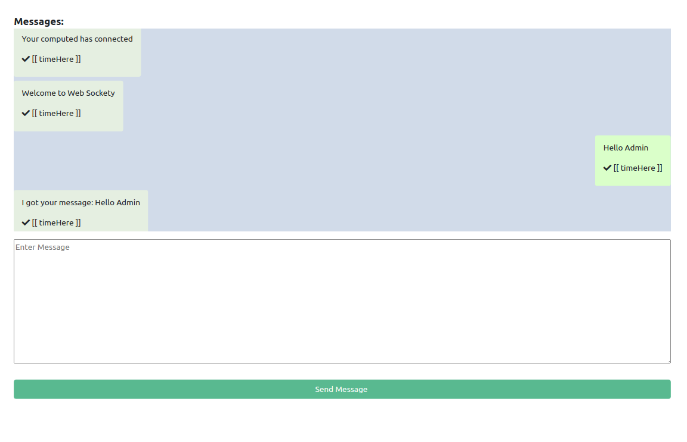

### Sockety

This repo was created for educational purposes. A simple light weight echo chat system over a web-socket

- Install depencies `npm install` or `yarn`
- Start server `npm run dev` or `yarn dev`

### Decisions && Lessons

###### Socket.io != WebScoket js

Supporting resources:
https://stackoverflow.com/questions/10112178/differences-between-socket-io-and-websockets

###### Socket.io can be bridged with WebSocket

Supporting resources
https://stackoverflow.com/questions/29604563/websocket-client-to-socket-io/45327746

-https://stackoverflow.com/questions/22232023/can-i-use-socket-io-client-to-connect-to-a-standard-websocket
